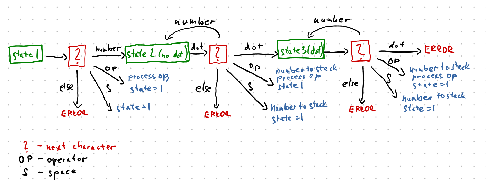

# Aprox - probability calculator

## Installation

Look into INSTALL.md.

We need to install Boost Math Toolkit:

`sudo apt-get install libboost-dev`

The next step is to compile the program:

 `make`

## Basic usage

Use `./aprox -h` for printing help. It shows you all possible command line
arguments. 

You can also use files as input or output of the program
(using `./aprox -i input_file` or `./aprox -o output_file`). 

Default notation of the expression is the infix notation,
however you can switch to prefix notation using `-p`.

## More advanced options

Option `-b` is used to define how big will be the bins that store the 
distributions. Default is 1. If you want to use small number (i.e. distributions
0.01 ~ 0.2), lower bin_size is recommended.

Option `-r` is used for printing the result distribution. If you set -1, all
the bins are printed. However using some natural number prints just
that many bins. Default is 25.

##

For a demo run `./run_tutorial.sh`.

# Programming specification

There are 3 main files:
 - `main.cpp` - it contains the class `Program` that manages the whole program
 (reads input, prints output, parses arguments and runs `compute()`).
 - `distribution.hpp` - file containing class `Distribution` that represents
 distributions and its operations.
 - `expression.hpp` - file containing class `Expression`, where the arithmetic
 expression is stored, parsed and evaluated. In order to do that we need to
 store more different types into a stack - for this reason there is the class
`Token` that handles it.

### Parsing the postfix expression

Parsing the postfix expression is done by this diagram:

